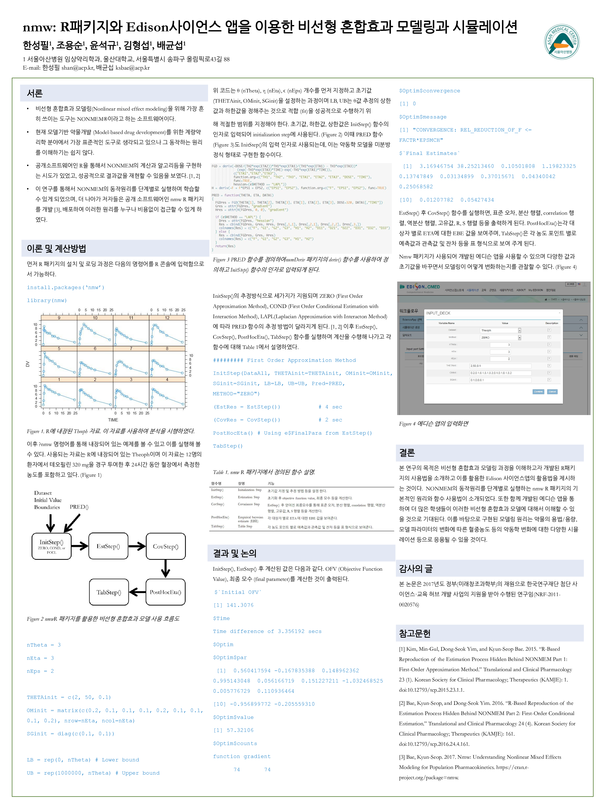

Understanding NONMEM using R
====================

-   author: Sungpil Han, Kyun-Seop Bae
-   <https://github.com/asancpt/edison-nmw>
-   license: GPL-3

## 중요한 링크

- R package: <https://github.com/cran/nmw>
- Edison App: <https://github.com/asancpt/edison-nmw-app>

